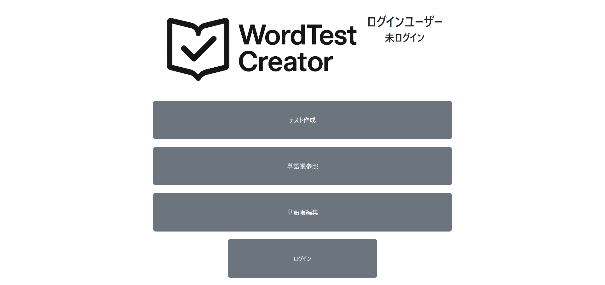
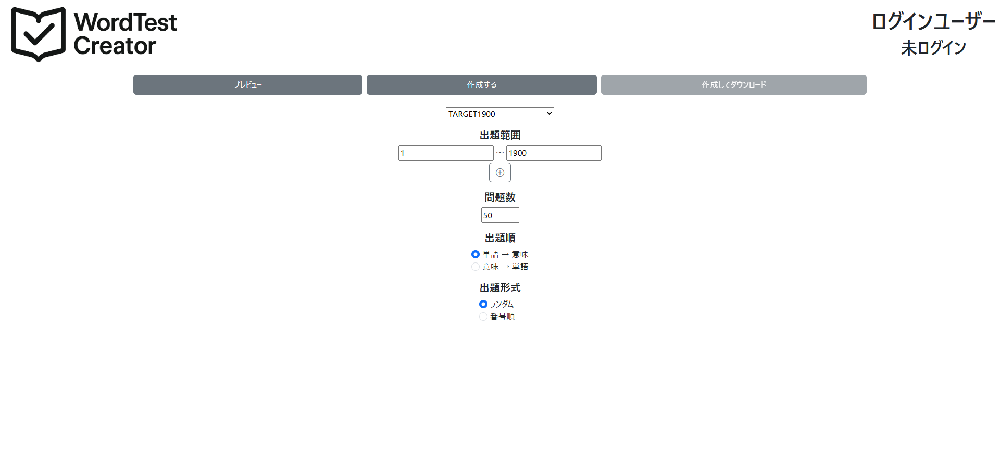
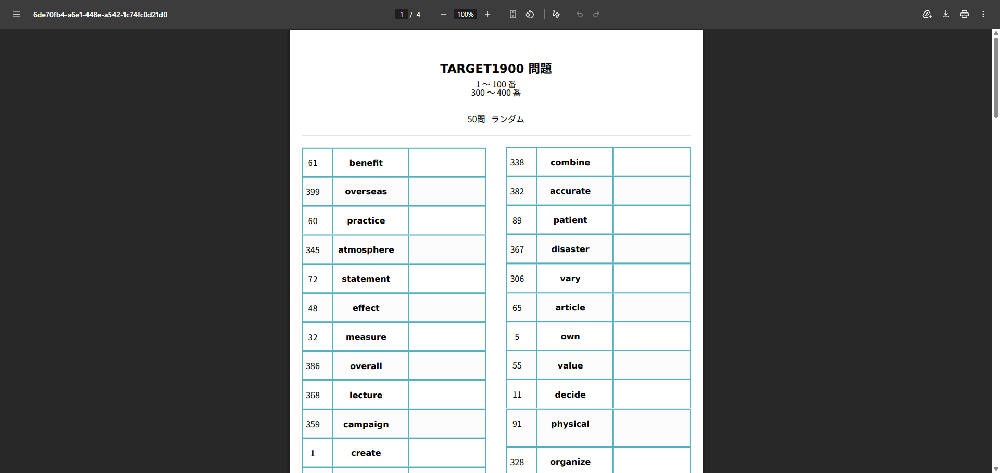
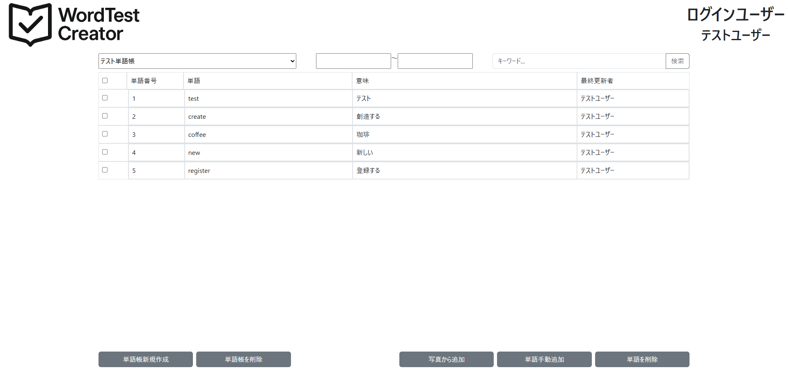
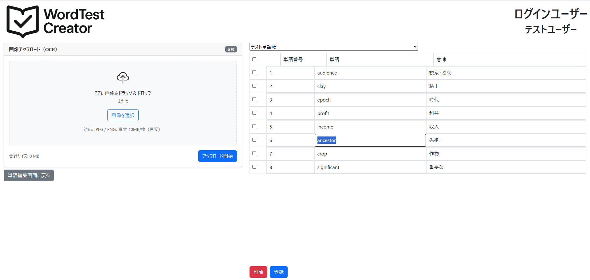

# WordTestCreator

## 概要
WordTestCreator は、塾講師が中高生向けの小テストを効率よく作成するための Web アプリケーションです。登録済みの単語帳から出題範囲や出題数を指定すると、英単語や古文単語などの単語テストを自動生成し、印刷しやすい PDF 形式で出力できます。

単語帳の内容はデータベースで管理されるため、講師は毎回問題を手作業で作り直す必要がありません。授業や宿題に合わせて範囲を指定するだけで、ランダム出題や番号順出題、出題方向の切り替えを行いながら、解答付きのテストをすばやく用意できます。

また、管理者は単語帳や単語データを編集でき、画像アップロードと OpenAI API を用いた OCR によって、紙面や画像から単語情報を登録する作業も補助できます。

## 主な機能
- 単語テストの作成
    - 単語帳を選択し、出題範囲と出題数を指定
    - 複数範囲を組み合わせた出題に対応
    - 「単語 → 意味」と「意味 → 単語」の出題形式を切り替え
    - ランダム順または番号順での出題を選択
    - 解答付き PDF を生成
- 単語帳・単語データの閲覧
    - データベースに登録された単語帳の一覧を確認
    - 単語帳ごとの単語番号、語、意味を確認
- 単語帳・単語データの管理
    - 管理者ユーザーによる単語の追加・編集・削除
    - 編集者情報の記録
- OCR による単語登録補助
    - 画像をアップロードして単語情報を抽出
    - OpenAI API を用いた OCR 結果を確認・修正して保存

## スクリーンショット
### ホーム画面

### テスト作成画面

### 作成されたテスト

[実際に作成された単語テストのPDFファイルはこちら](docs/sample/word-test.pdf)
### 単語帳編集画面

### 写真から単語帳を登録する画面


## 使用技術
- バックエンド
    - Python
    - Django 5.2.4
    - Django Template
    - Django 認証機能（カスタム管理者ユーザー）
- フロントエンド
    - HTML / CSS
    - TypeScript
    - Bootstrap 5.3
    - Bootstrap Icons
- PDF 生成
    - WeasyPrint 66.0
    - HTML / CSS で作成したテスト画面を PDF に変換
- OCR / 外部 API
    - OpenAI API
    - OpenAI Python SDK
    - 画像アップロードした単語帳から単語番号・語・意味を抽出
- データベース
    - SQLite（ローカル開発環境）
    - TiDB（デプロイ環境）
- 開発・ビルド
    - npm
    - TypeScript Compiler
    - tsc-alias
    - python-dotenv
- デプロイ・運用
    - GCP（Google Cloud Platform）
    - Django static / media ファイル管理

## アーキテクチャ
WordTestCreator は Django プロジェクトを中心に、機能ごとにアプリケーションを分割した構成になっています。画面表示は Django Template で行い、単語帳編集やテスト生成などの画面内操作は TypeScript で実装したフロントエンドから Django の各ビューへリクエストを送る形で処理しています。

### アプリケーション構成
- `home`
    - ホーム画面を担当
    - テスト作成、単語帳閲覧、単語帳編集、ログイン画面への導線を提供
- `accounts`
    - 管理者ユーザーの認証を担当
    - Django の認証機能をベースに、ユーザー名とパスワードでログインするカスタムユーザー `AdminUser` を管理
- `wordbank`
    - 単語帳 `WordList` の作成・削除・取得を担当
    - フロントエンドから単語帳一覧を取得するためのエンドポイントも提供
- `vocab`
    - 単語 `Word` の閲覧・追加・編集・削除を担当
    - 単語帳ごとの単語一覧表示と、管理者向けの編集画面を提供
- `ocr`
    - 画像アップロードと OpenAI API を用いた OCR 処理を担当
    - 抽出した単語情報を画面上で確認・修正できる形で返す
- `quiz`
    - テスト作成条件の入力、プレビュー、PDF 生成を担当
    - 指定された単語帳・範囲・出題形式をもとに問題データを作成し、WeasyPrint で PDF に変換

### データ構成
- `AdminUser`
    - 管理者ユーザーを表すカスタムユーザーモデル
    - 単語帳作成者や単語の最終編集者として記録される
- `WordList`
    - 単語帳を表すモデル
    - 単語帳名、作成者、作成日時を保持
- `Word`
    - 単語データを表すモデル
    - 単語番号、語、意味、所属単語帳、最終編集者、最終更新日時を保持
    - `WordList` と 1 対多の関係を持つ

### 主な処理の流れ
- テスト作成
    - ユーザーが `quiz` の設定画面で単語帳、範囲、出題数、出題形式を指定
    - `quiz` が `WordList` と `Word` から対象データを取得し、問題用のコンテキストを生成
    - Django Template で HTML を組み立て、WeasyPrint で PDF に変換
    - 生成された PDF をブラウザで表示またはダウンロード
- 単語帳編集
    - 管理者ユーザーが `vocab` の編集画面から単語を追加・編集・削除
    - フロントエンドは編集結果を画面に反映し、Django 側へ非同期に保存リクエストを送信
    - 保存時にログイン中のユーザーが最終編集者として記録される
- OCR 登録
    - 管理者ユーザーが `ocr` 画面で単語帳画像をアップロード
    - `ocr` が OpenAI API に画像を送信し、単語番号・語・意味を JSON として抽出
    - 抽出結果を画面で確認・修正したうえで、単語データとして保存

## 実装上のポイント
- 編集作業を止めにくい単語帳管理
    - 単語帳には大量の単語を登録・修正するため、編集のたびに画面全体を再読み込みすると作業効率が落ちる
    - 単語の追加・編集・削除は TypeScript 側で画面表示を更新し、Django 側への保存は `fetch` による非同期通信で行う
    - 連続して単語を登録しやすいように、登録後は次の単語番号を自動で入力し、単語・意味の入力欄だけをリセットする
- OCR による単語登録の補助
    - 単語帳の内容をすべて手入力すると時間がかかり、入力ミスも起こりやすい
    - OpenAI API に画像を送信し、単語番号・語・意味を JSON として抽出することで、紙面や画像からの登録作業を短縮している
    - OCR 結果はそのまま保存せず、画面上で確認・修正してから単語データとして登録できる流れにしている
    - API のリクエストID、使用モデル、推定費用、利用者を記録し、OCR 利用状況をあとから確認できるようにしている
- 権限管理と編集履歴
    - 単語データの誤編集・誤削除は影響が大きいため、単語帳や単語の編集はログイン済みの管理者ユーザーに限定している
    - Django の認証機能をベースに、管理用のカスタムユーザーモデル `AdminUser` を定義している
    - 単語を編集した際は、ログイン中のユーザーを最終編集者として保存し、誰が最後に更新したかを追跡できるようにしている
- 柔軟なテスト生成
    - 複数の出題範囲を指定できるようにし、Django の `Q` オブジェクトで範囲条件をまとめて検索している
    - 「単語 → 意味」と「意味 → 単語」の切り替えは、PDF 生成前のコンテキスト作成時に問題文と解答を入れ替えることで実現している
    - ランダム出題と番号順出題を選べるようにし、授業内容や確認テストの用途に合わせて使い分けられるようにしている
- HTML / CSS ベースの PDF 生成
    - テスト用の HTML を Django Template で作成し、それを WeasyPrint で PDF に変換している
    - Web 画面と同じ HTML / CSS の考え方でレイアウトを調整できるため、問題用紙の見た目を管理しやすい
    - 生成した PDF はブラウザでそのまま表示できるようにし、印刷までの手順を少なくしている

## セットアップ
### ローカル開発環境
1. リポジトリをクローンする
    ```bash
    git clone https://github.com/magu1436/TestCreator.git
    cd TestCreator
    ```

2. Python の仮想環境を作成して有効化する
    ```bash
    python -m venv .venv
    .venv\Scripts\activate
    ```

    macOS / Linux の場合は次のコマンドで有効化する。
    ```bash
    source .venv/bin/activate
    ```

3. Python パッケージをインストールする
    ```bash
    pip install -r requirements.txt
    ```

4. フロントエンド用のパッケージをインストールする
    ```bash
    npm install
    ```

5. TypeScript をビルドする
    ```bash
    npm run build
    ```

    開発中に TypeScript の変更を監視したい場合は、別ターミナルで次のコマンドを実行する。
    ```bash
    npm run watch
    ```

6. データベースを初期化する
    ```bash
    python manage.py migrate
    ```

7. 管理者ユーザーを作成する
    ```bash
    python manage.py createsuperuser
    ```

8. 開発サーバーを起動する
    ```bash
    python manage.py runserver
    ```

    起動後、ブラウザで `http://127.0.0.1:8000/` にアクセスする。

### OCR 機能を使う場合
OpenAI API を利用するため、API キーを環境変数に設定する。デプロイ環境では `OPENAI_API_KEY` を使用する。

現在の `main` ブランチのローカル設定では `settings.py` が `API_KEY` を参照しているため、ローカルで OCR を動かす場合は `API_KEY` にも同じ値を設定する。

```env
OPENAI_API_KEY=sk-...
API_KEY=sk-...
```

### デプロイ
GCP などにコンテナとしてデプロイする場合は、`deploy` ブランチを利用する。`deploy` ブランチには `Dockerfile`、`.dockerignore`、`entrypoint.sh` が含まれており、起動時に次の処理を行う構成になっている。

- `python manage.py migrate --noinput` によるマイグレーション
- `DJANGO_SUPERUSER_USERNAME` と `DJANGO_SUPERUSER_PASSWORD` が設定されている場合のスーパーユーザー作成
- Gunicorn による Django アプリケーションの起動
- WhiteNoise による static ファイル配信

デプロイ時は、下記の環境変数を実行環境に設定する。

## 環境変数
|環境変数名|概要|
|:---:|:---|
|TIDB_ENABLE|TiDB を使用するかどうかを切り替えるためのフラグ|
|TIDB_NAME|接続先 TiDB のデータベース名|
|TIDB_USER|TiDB に接続するユーザー名|
|TIDB_HOST|TiDB のホスト名|
|TIDB_PORT|TiDB のポート番号。未指定の場合は `4000` を想定|
|ALLOWED_HOSTS|Django がリクエストを許可するホスト名。複数指定する場合はカンマ区切り|
|CSRF_TRUSTED_ORIGINS|Django の CSRF 検証で信頼するオリジン。複数指定する場合はカンマ区切り|
|DJANGO_SUPERUSER_USERNAME|起動時に作成するスーパーユーザーのユーザー名|
|TIDB_SSL_CA|TiDB への SSL 接続で使用する CA 証明書ファイルのパス|
|DJANGO_DEBUG|Django をデバッグモードで動作させるかどうか。`true` の場合に有効|
|DJANGO_SECRET_KEY|Django の署名や暗号化に使用するシークレットキー|
|TIDB_PASSWORD|TiDB に接続するユーザーのパスワード|
|OPENAI_API_KEY|OCR 機能で使用する OpenAI API キー|
|DJANGO_SUPERUSER_PASSWORD|起動時に作成するスーパーユーザーのパスワード|

## 今後の改善予定
- 単語データ閲覧機能の改善
    - 登録済みの単語が増えると目的の単語を探しにくくなるため、単語帳閲覧画面に検索機能を追加する
    - 単語番号、語、意味を条件に絞り込めるようにし、データ確認の手間を減らす
- ログイン画面・管理画面の整理
    - 現在のログイン画面を見直し、管理者向けの導線や表示を分かりやすくする
    - スーパー管理者が管理者ユーザーを作成・管理できる画面を実装する
    - 現状は Django 標準の管理サイトで代替している管理操作を、アプリ内で扱いやすくする
- フロントエンド構成の見直し
    - 現在は Django Template と TypeScript を組み合わせて画面ごとの処理を実装している
    - 将来的には React などのフロントエンドフレームワークを導入し、状態管理やコンポーネント分割の見通しを良くする
- 単語登録作業の効率化
    - 手動登録や OCR 登録後の修正作業にかかる時間をさらに短縮する
    - 連続入力、入力補助、OCR 結果の確認 UI を改善し、大量の単語を登録しやすくする
- PDF レイアウトの安定化
    - 生成された単語テストで、単語や意味が長い場合にレイアウトが崩れることがある
    - 改ページ、カラム分割、文字サイズ、余白の調整を行い、印刷時に読みやすい PDF を安定して出力できるようにする
